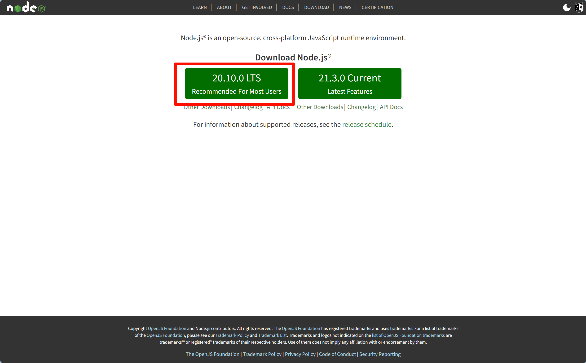
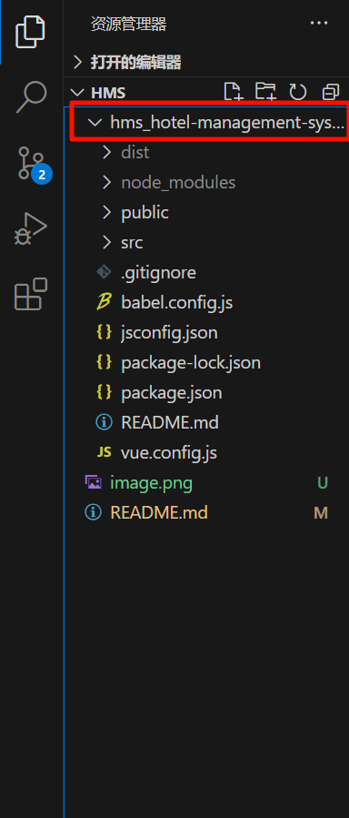
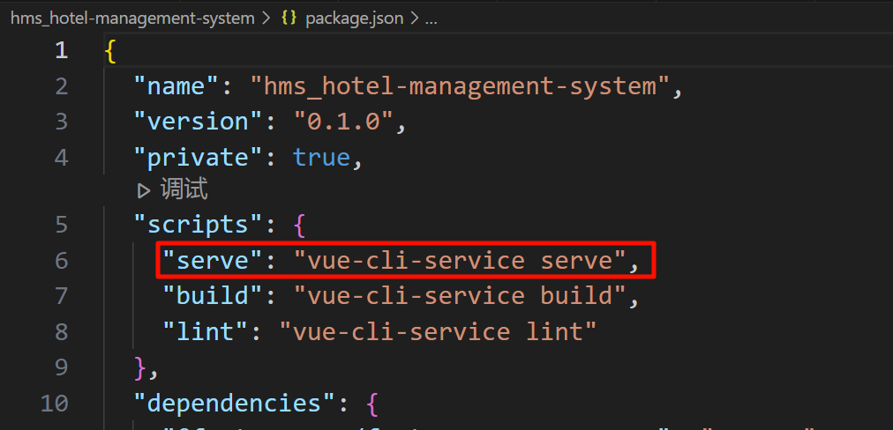
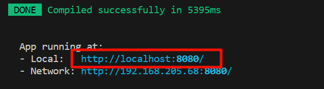

# HMS(Hotel-Management-System 酒店管理系统)

## 初始化
1. 首先下载并安装 Node.js 

    在修改完安装位置后可以一直点下一步（里面会默认自动配置环境变量）

    官网：https://nodejs.org/en
    

2. 打开命令窗口（win + R）

    ```
    node -v
    ```

    如果查找得到版本号，即为安装成功

3. 安装淘宝镜像cnpm

    在命令行窗口中输入以下语句：

    ```
    npm install -g cnpm --registry=https://registry.npm.taobao.org
    ```

4. 在VScode中打开项目

    
    
    右键文件，选择 ' 在集成终端中打开 '
    
    接着在继承终端中输入以下命令：
    
    ```
    npm i
    ```
    
    等待下载完成
    
5. 运行

    在项目中找到 package.json 
    
    
    该命令即为启动命令，在终端中输入即可
    
    
    按住 Ctrl 点击链接即可快捷打开
    
    注意：在启动前端页面之前，请先运行后端服务器，并保证数据库已经配置完成