# 文档说明
在本文档中，动图中部分边框消失为动图压缩导致，实际效果见网站
# 网站启动
1. 打开网站之后，如果未登录过，则除了登录页面（/login），其他页面无法访问，访问会直接跳转至登录页面

# 登录界面
## 注册
1. 点击蓝色提示字进入注册模块，如果在注册页面，有输入框未输入，则会弹出提醒，并且输入框变红提醒

2. 在注册界面点击蓝色提示字即可返回登录模块

3. 注册账号有规则要求，如果没有按规则创建，则会弹出提示框提醒（账号和密码同理）

4. 成功注册后，自动跳转到登录模块，并且自动将账号密码填写完成

## 登录
1. 在账号密码无错误的情况下，点击下一步，即可登录，跳转至房间管理页面

2. 在任意功能页面，点击最左边导航栏中的退出登录，即退出登录

# 房间管理
1. 楼层选择器：选择相应楼层，即可快速筛选
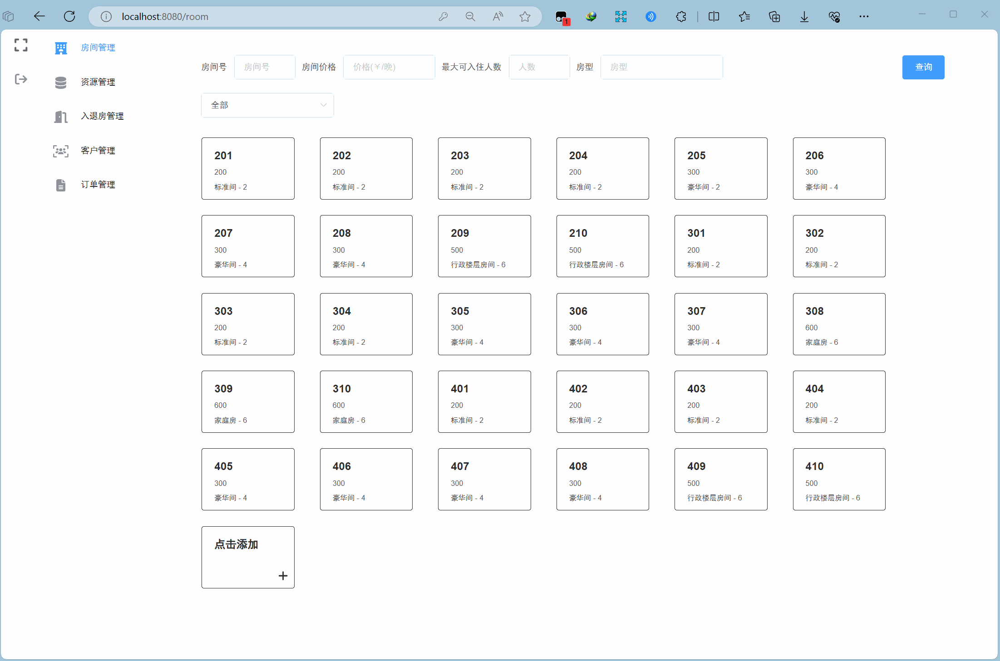

2.点击添加：点击后会弹出窗口给予填写，填写完成点击确定即可提交添加

3.修改房间信息：点击对应的房间按钮，即可打开弹出，修改完成点击确定提交

4.删除房间：点击房间，在弹窗的右下脚点击删除即可
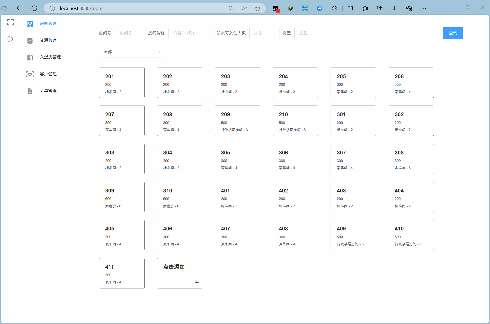

5.查询（模糊查询）：在页面最上方，填写需要查询的条件，点击查询即可

# 资源管理
1. 选择查找
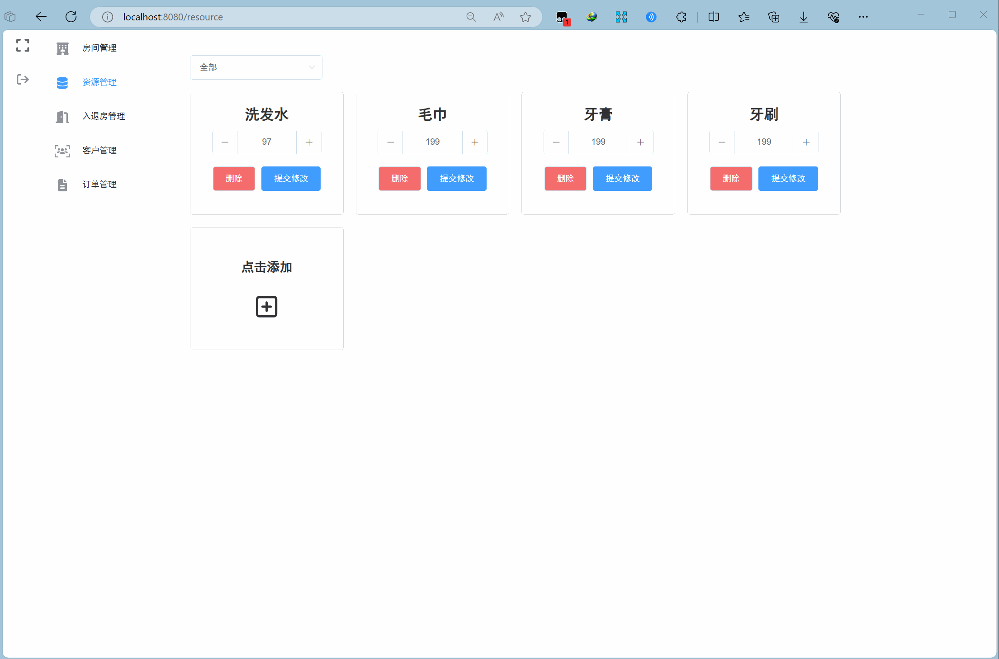

2. 修改数据：按钮可快速更改数据，修改完需要提交
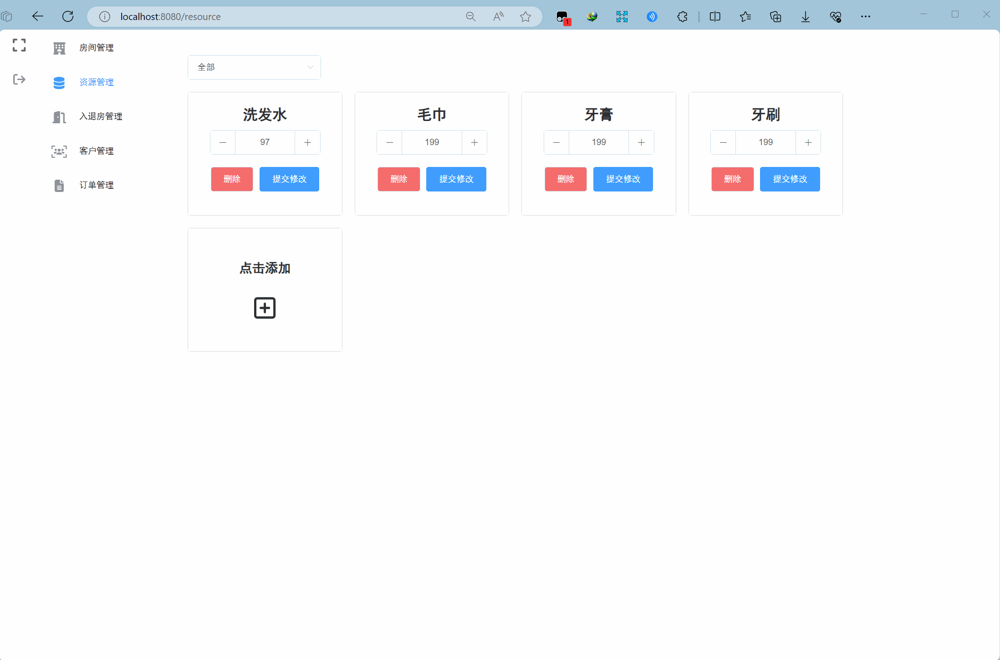

3. 删除数据，点击确认后删除

4. 添加数据：点击“点击添加”后即可添加
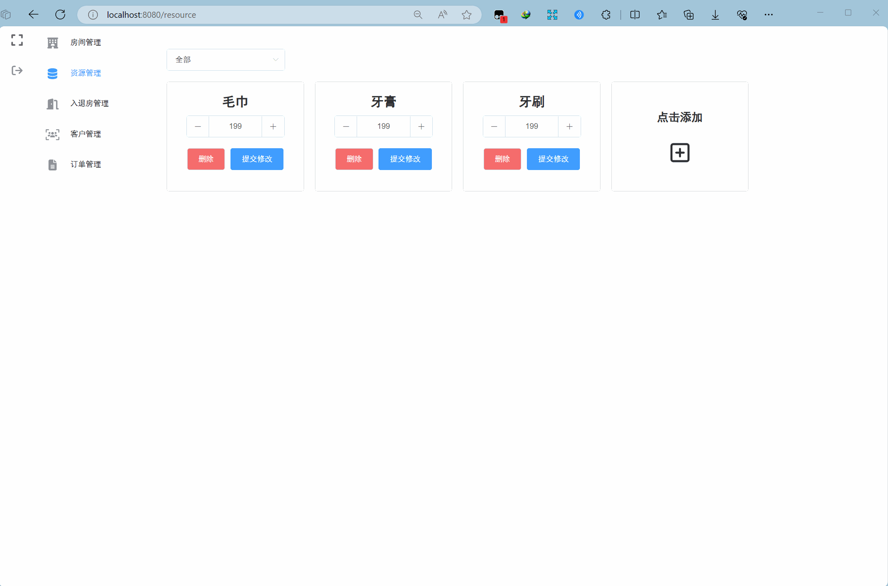

# 入退房管理

可通过点击上方标签来切换不同的功能
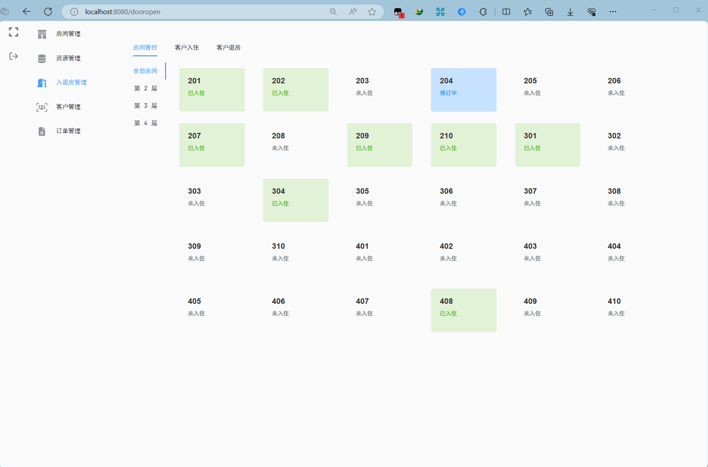
## 房间管控
1. 楼层切换（该页面中，“已入住”的房间显示为绿色、“预订中”的房间显示为蓝色）

2. 查询房间信息及该房间的历史住客（无历史住客即为“无数据”）

## 客户入住
1. 在选择完房间号、入住时间后，会出现总价，可通过调节折扣来改变价格
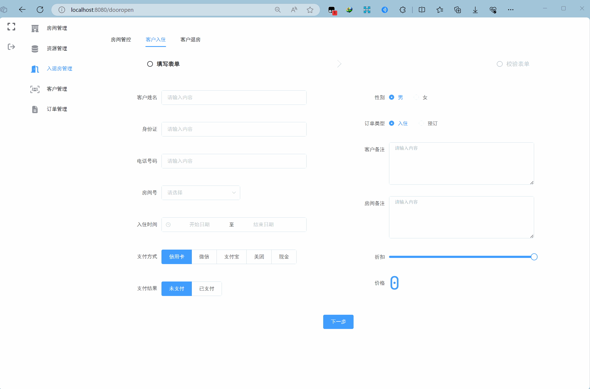

2. 在选择入住时，如果没支付，无法进行下一步
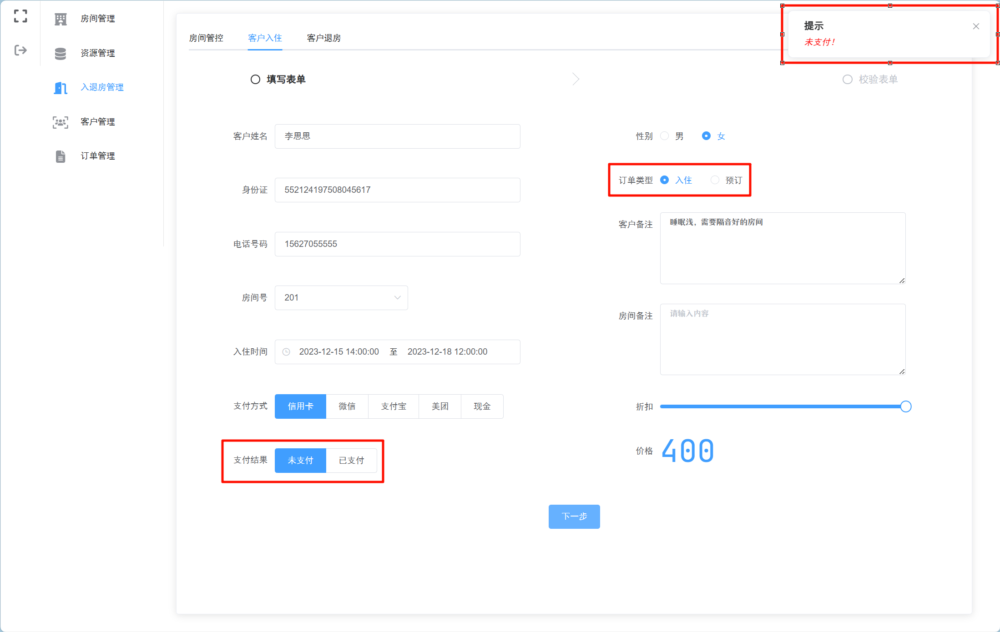

3. 在完成表单填写后，会将信息展示，方便管理员校对
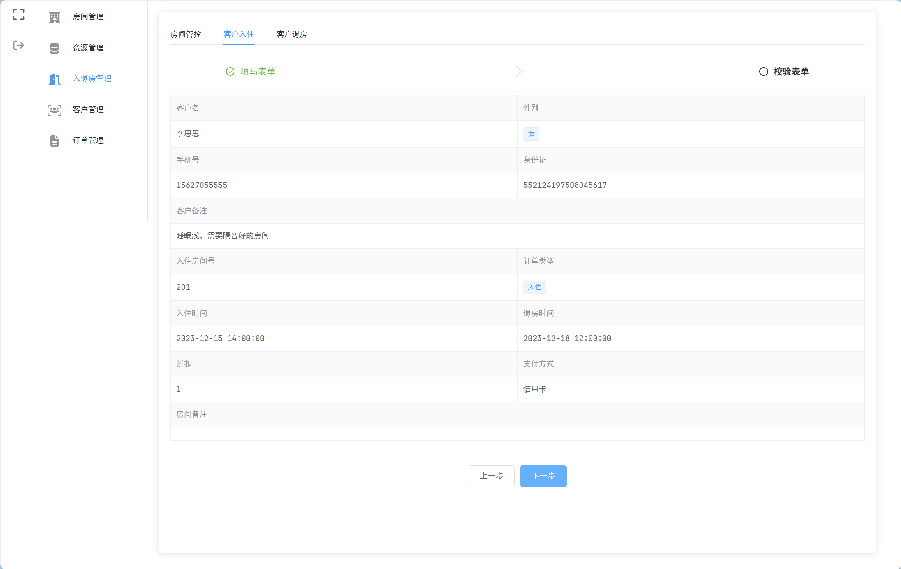

## 客户退房
1. 在该页面选择房间，会自动判断是“退房”还是“取消订单”
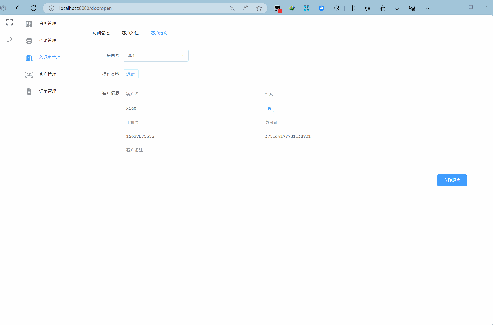

# 客户管理
1. 页面下方会有分页条，可选择每页展示的数据量
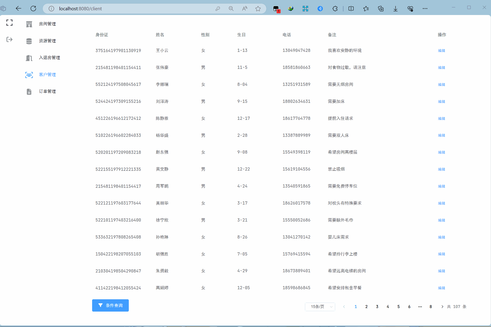

2. 点击编辑，出现信息编辑弹窗，点击确定即可提交修改

3. 点击条件查询，出现弹窗，支持模糊查询，查询结果在弹窗中展示

# 订单管理

该页面上方固定展示今日营业额及今年某月的营业额

1. 分页条效果同“客户管理”页面

2. 点击查看，即可查看该订单的详细信息
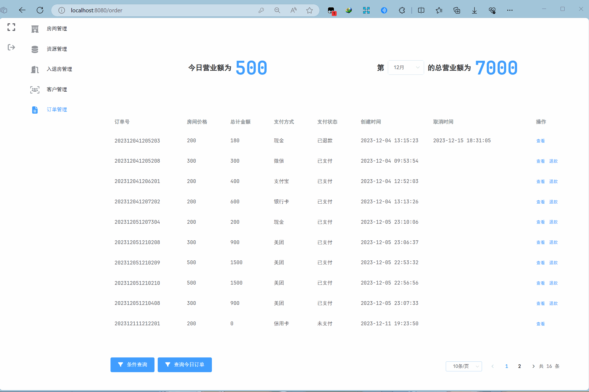

3. 如果订单为“已支付”，则出现退款操作，点击后弹出警告。如果确认，即刻退款

4. 点击“查询今日订单”，即可快捷查询今天的所有订单

5. 点击“条件查询”，出现条件查询弹窗，点击确定即可完成查询
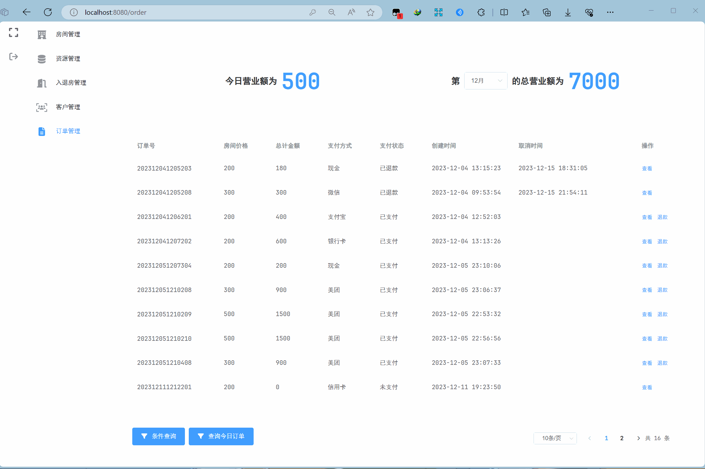

6. 在上方可快捷选择月份查看今年某月的营业额（年份根据系统时间）
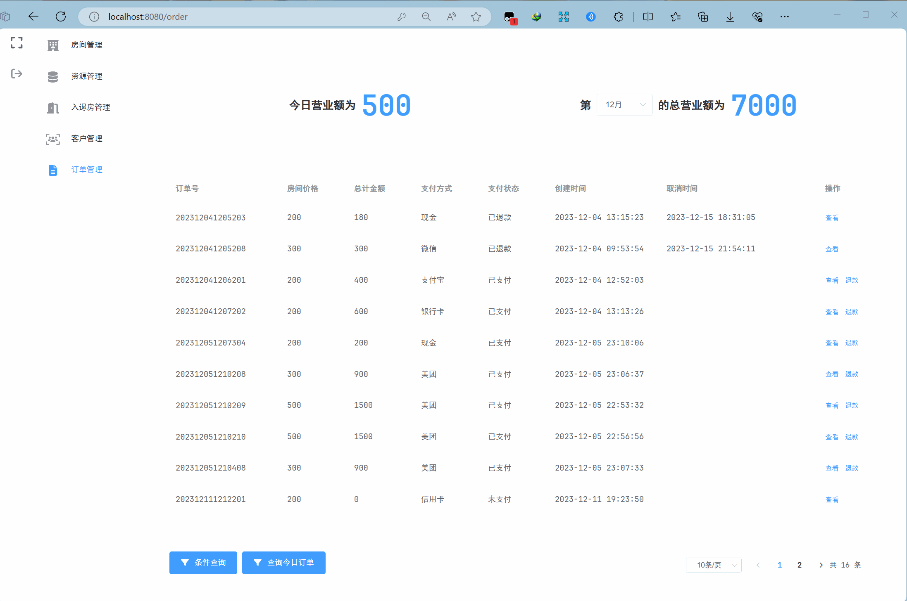
