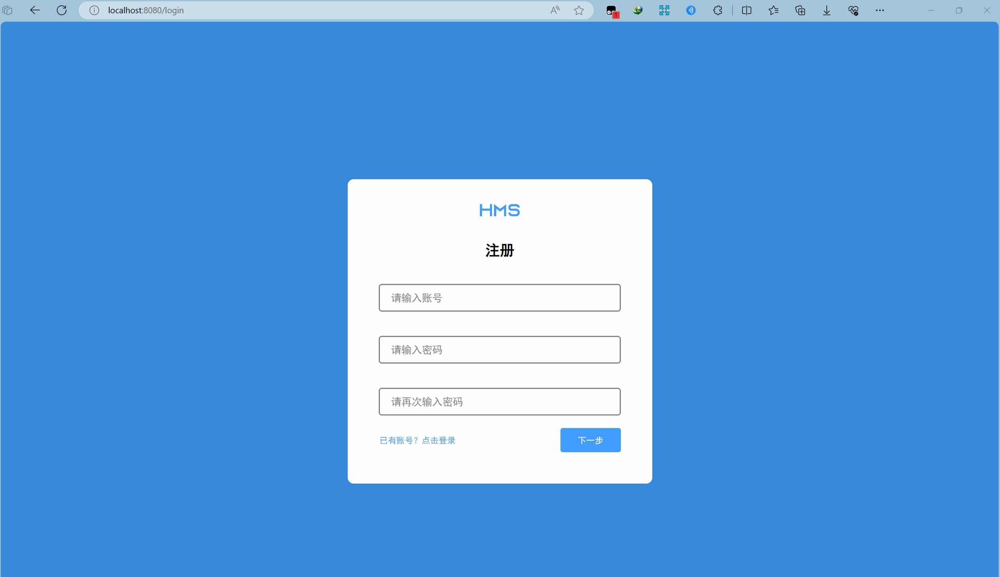

# 文档说明
在本文档中，动图中部分边框消失为动图压缩导致，实际效果见网站
# 网站启动
1. 打开网站之后，如果未登录过，则除了登录页面（/login），其他页面无法访问，访问会直接跳转至登录页面

# 登录界面
## 注册
1. 点击蓝色提示字进入注册模块，如果在注册页面，有输入框未输入，则会弹出提醒，并且输入框变红提醒

2. 在注册界面点击蓝色提示字即可返回登录模块

3. 注册账号有规则要求，如果没有按规则创建，则会弹出提示框提醒（账号和密码同理）

4. 成功注册后，自动跳转到登录模块，并且自动将账号密码填写完成

## 登录
1. 在账号密码无错误的情况下，点击下一步，即可登录，跳转至房间管理页面

2. 在任意功能页面，点击最左边导航栏中的退出登录，即退出登录

